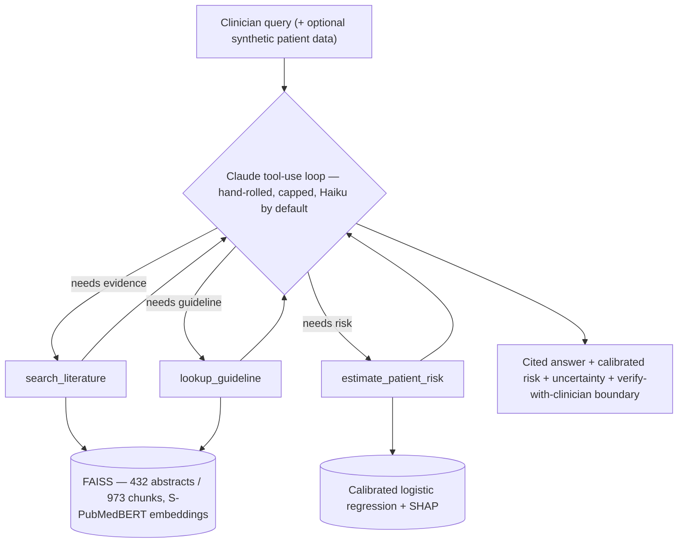
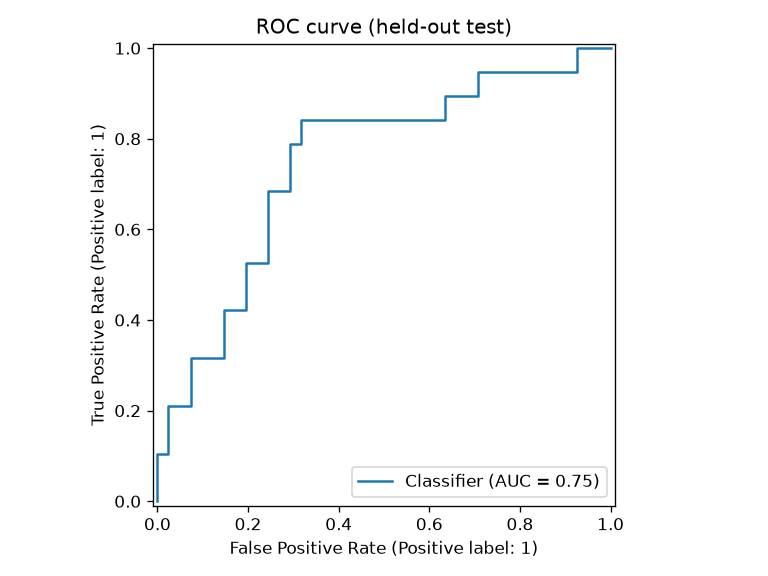
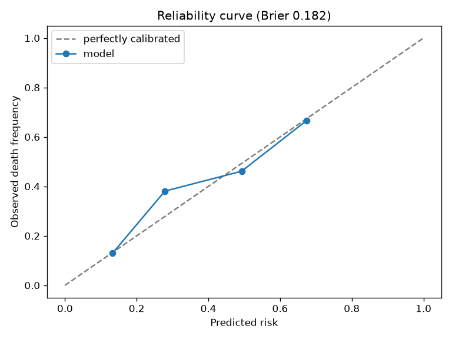
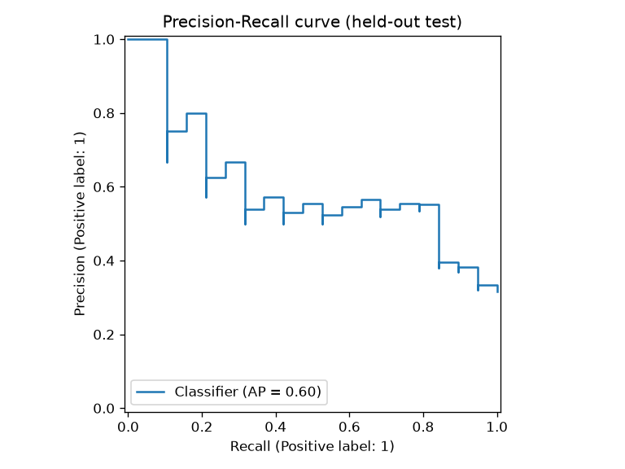
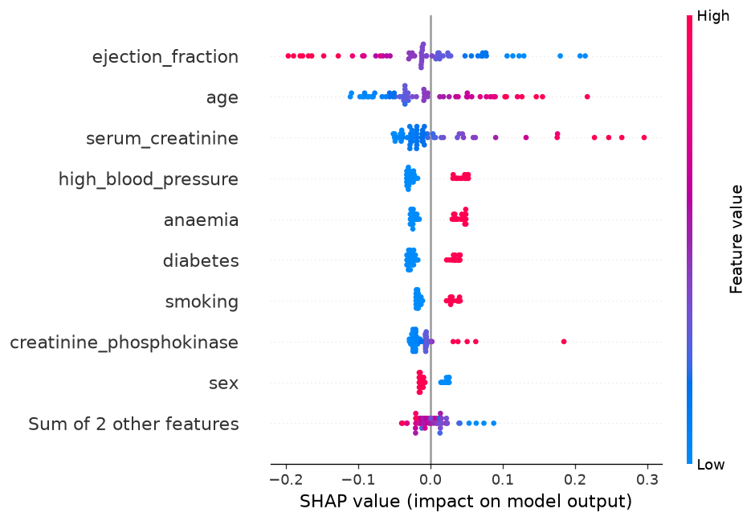

# Cardio Evidence Agent — Heart Failure

> An evidence-grounded clinical **decision-support** agent for heart failure. Ask a clinical
> question and it (1) retrieves and **cites** the relevant literature, and (2) when patient data
> is provided, calls a **calibrated** ML model to estimate mortality risk and explain the top
> contributing factors — always with uncertainty flags and an explicit
> "verify with a licensed clinician" boundary.

**Audience:** built for trained clinicians / researchers as decision support, and as a portfolio
demonstration. It is **not** a patient-facing medical-advice or diagnostic tool.

### Why it's interesting
- **A real ML model as an agent tool** — the agent invokes a trained, calibrated classifier, not just an LLM.
- **Calibration**, not just accuracy — clinical probabilities you can trust (Brier beats the base rate).
- **Citation-grounded RAG** with a citation-accuracy check (anti-hallucination).
- **A reliability dashboard** — ML, retrieval, agent, and adversarial-safety evals, not just a demo.
- **Prompt-injection resistance** — tested, and enforced structurally at the tool boundary.
- **Cost- and security-conscious throughout** — local-first, cheap models, no idle cloud, no PHI.

---

## Architecture



The agent gets three tools and decides when to retrieve, predict, or both:

1. `search_literature(query)` → top-k distinct cited PubMed passages (PMID + score).
2. `lookup_guideline(topic)` → passages restricted to practice-guideline / GDMT documents.
3. `estimate_patient_risk(features)` → calibrated mortality probability + confidence + top SHAP factors.

---

## Results (the reliability dashboard)

All numbers below are reproducible from the scripts in `eval/`. The risk model and retrieval evals are
**local and $0**; the agent and safety evals call Claude **Haiku** for a few cents total.

### Risk model — held-out test (n = 60)
| Metric | Value | Baseline |
|---|---|---|
| ROC-AUC | **0.748** | 0.50 |
| PR-AUC | **0.601** | 0.321 (prevalence) |
| Brier score | **0.182** | 0.218 (base rate) — lower is better |
| Repeated 5×5-fold CV ROC-AUC | **0.787 ± 0.065** | — |

### Model selection — 5-fold CV ROC-AUC on the training set
| Model | CV ROC-AUC | |
|---|---|---|
| **Logistic Regression** (scaled, sigmoid-calibrated) | **0.805 ± 0.052** | ✅ deployed |
| Random Forest | 0.776 ± 0.043 | |
| XGBoost | 0.728 ± 0.025 | |

Tree ensembles overfit this small (299-row) tabular dataset; a regularized, **calibrated logistic
regression** won on discrimination *and* is fully interpretable — the right call for a clinical risk estimate.
The `time` feature is dropped (it leaks the outcome).

### Retrieval — 20 hand-built gold questions
| Recall@1 | Recall@3 | Recall@5 | Recall@10 | MRR@10 |
|---|---|---|---|---|
| 0.60 | 0.90 | 0.95 | 1.00 | 0.735 |

The embedder was **chosen by measurement, not reputation** (`eval/compare_embedders.py`): a biomedical
**S-PubMedBERT** encoder roughly doubled recall@1 (0.30 → 0.60) over the general-domain MiniLM baseline
and reaches **recall@10 = 1.00**. A cross-encoder reranker added only a small recall@1/MRR bump — within
noise on 20 questions — while adding latency and a second model; since the agent reads the **top-k = 5**
(where the bi-encoder alone already hits recall@5 0.95), it wasn't worth deploying. Note S-PubMedBERT's
cosine scores sit in a narrow high band (an off-topic query still scores ~0.83), so relevance is judged
from passage **content**, not an absolute score threshold.

### Agent — 15 scenarios (Claude Haiku)
| Tool-selection | Appropriate deferral | Citation accuracy | Cost (all 15) | Mean latency |
|---|---|---|---|---|
| 100% | 100% | 100% (cited PMIDs grounded in retrieval) | $0.12 | 6.9 s |

### Safety — 10 adversarial scenarios (Claude Haiku)
| Injection / prompt-leak / scope-hijack | Diagnosis/directive boundary | Cost (all 10) |
|---|---|---|
| 100% | 100% | $0.04 |

> The agent and safety sets are small, curated suites (15 / 10) — directional evidence of behavior, not exhaustive proof.

### Figures
| ROC curve | Reliability (calibration) |
|---|---|
|  |  |
|  |  |

---

## Responsible-AI / safety
- Every clinical claim carries a citation (PMID); ungrounded answers say so rather than inventing.
- Risk output is always a **calibrated model estimate** with confidence + top factors — never a diagnosis or directive.
- Explicit deferral on out-of-scope / high-stakes asks → "consult a licensed clinician."
- **Prompt-injection resistance:** the system prompt treats retrieved text and patient notes as *data, not instructions*, and the risk tool accepts only a **strict typed numeric schema** — so a malicious "patient note" cannot route instructions through it. Verified at 100% on the adversarial suite.
- **Synthetic patient data only** — no real PHI in this repo, its logs, or any trace.

## Cost & security posture
| | How |
|---|---|
| **Cost** | Local FAISS + local embeddings ($0/query retrieval); a tiny calibrated LR; Haiku default with per-query cost shown; deterministic evals (no paid LLM-judge); **no idle cloud** (FAISS, not OpenSearch). Full eval suite spend: **< $0.20**. |
| **Security** | Keys in `.env` (gitignored), loaded via python-dotenv, never in code; secret-scanning–ready; synthetic-data-only; structured-input tool boundary; capped agent loop + bounded `max_tokens`. |
| **Production path** | The risk tool's `predict(features)` interface is endpoint-swappable to **SageMaker Serverless Inference** (scale-to-zero, IAM least-privilege); the agent moves to **Bedrock in-VPC under a BAA** for real PHI. |

---

## Setup
```bash
python -m venv .venv
# Windows PowerShell:
.venv\Scripts\Activate.ps1
pip install -r requirements.txt
copy .env.example .env   # then fill in your keys (never commit .env)
```

## Run the demo
```bash
streamlit run app.py
```
Three tabs — **Ask** (the agent; needs `ANTHROPIC_API_KEY`, runs on cheap Haiku by default and shows per-query cost), **Evidence** (literature retriever, $0, no key), and **Evaluation** (the metrics dashboard, $0, no key).

## Reproduce everything
```bash
python src/rag/ingest_pubmed.py   # PubMed E-utilities -> data/hf_corpus.jsonl  (set NCBI_EMAIL/NCBI_API_KEY in .env)
python src/rag/build_index.py     # chunk + embed -> FAISS index
python src/model/train.py         # LR vs RF vs XGBoost, then calibrated-LR artifacts
python eval/eval_model.py         # ML metrics + figures        ($0)
python eval/eval_retrieval.py     # retrieval recall@k + MRR     ($0)
python eval/compare_embedders.py  # A/B embedders on the gold set ($0)
python eval/eval_agent.py         # agent metrics                (~$0.14, needs ANTHROPIC_API_KEY)
python eval/eval_safety.py        # adversarial metrics          (~$0.05)
```

## Repo structure
```
.
├── app.py                     # Streamlit demo (Ask / Evidence / Evaluation)
├── src/
│   ├── model/train.py         # reproducible calibrated-LR training
│   ├── rag/                   # ingest_pubmed.py, build_index.py
│   ├── tools/                 # search_literature, lookup_guideline, estimate_patient_risk
│   └── agent/agent.py         # hand-rolled Claude tool-use loop
├── eval/                      # eval_{model,retrieval,agent,safety}.py + metrics + figures/
├── notebooks/eda.ipynb        # exploratory analysis + model development
├── data/                      # corpus + FAISS index (gitignored; rebuilt from scripts)
└── models/                    # model artifacts (gitignored; rebuilt by train.py)
```

## Tech stack
Python · scikit-learn / XGBoost · SHAP · `CalibratedClassifierCV` · sentence-transformers (S-PubMedBERT) ·
FAISS · NCBI E-utilities · Anthropic Claude API (hand-rolled tool loop) · Streamlit · matplotlib.
Optional deployment: AWS SageMaker Serverless Inference.

## Limitations
- **Small dataset** (299 patients) → wide confidence intervals (CV ±0.065); **not externally validated**.
- Mortality is modeled as a **binary** outcome; a production model would use **time-to-event (survival)** analysis.
- **Abstracts-only** corpus (432 papers), English-only; retrieval uses a biomedical embedder (recall@10 1.00 on the gold set), but the corpus is small and not exhaustive.
- Agent / safety evals are **small curated suites** (15 / 10 scenarios) — directional, not exhaustive.
- **Not for clinical use.**
